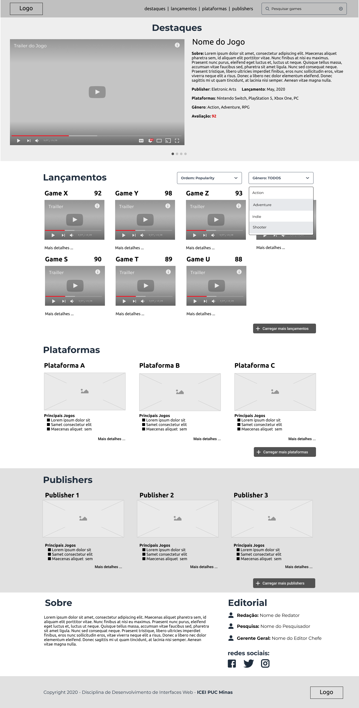
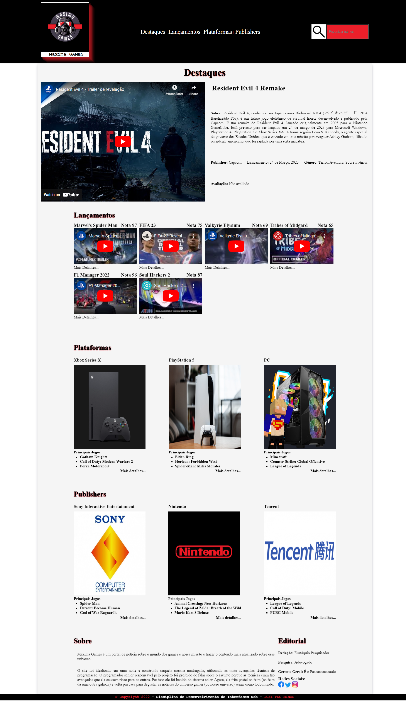

# Portal de Games Responsivo

> Primeiro Trabalho Prático da Disciplina de Desenvolvimento de Interfaces Web - PUC Minas 2022/2

O objetivo do trabalho é desenvolver um portal de games **responsivo**, ou seja, um site cujo layout se adapte conforme o tamanho de tela do usuário.

Nos foi dado um wireframe como norte e fomos fortemente instruidos a apontar melhorias para o layout do site.

## Site Apresentado

### Orientações Gerais

- Trabalho Individual
- Utilizar imagens reais e textos coerentes com o assunto
- O site deve ser responsivo e se adequar corretamente ás telas de diferentes dispositivos (desktops, celulares e tablets)
- Site estático e com exemplos reais
- Cada aluno deve pensar o formato da versão mobile

### Como será o processo de avaliação

A avaliação será conduzida com a participação dos **próprios alunos**. 

Cada aluno deverá avaliar 3 projetos de outros colegas e atribuir pontos, que foram distribuídos pelas entregas da atividade. **O aluno receberá 1 ponto adicional pela participação no processo**. Após a revisão dos alunos, os professores consolidam as notas dos alunos usando a média das notas recebidas.

Caso algum aluno não fique satisfeito com a nota, poderá preencher um formulário de contestação que será liberado juntamente com as notas consolidadas. Na revisão professor, a nota do aluno poderá ser alterada para mais ou para menos.

Os critérios a serem utilizados na avaliação que será feita tanto pelos alunos quanto pelos professores no caso de contestação são os seguintes: 

#### `CRITÉRIO 1: Conformidade com o Wireframe:`

- 3 pontos - O aluno seguiu orientações do wireframe, realizando incrementos ou alterações que melhoraram a estrutura de componentes do site;
- 1,5 pontos - Seguiu parcialmente o wireframe;
- 0 pontos - Não seguiu o wireframe.

#### `CRITÉRIO 2: Conteúdo:`

- 2 pontos - Conteúdos reais para o site: Utilizou imagens, textos, vídeos que contemplam o cenário de um site real;
- 1 pontos - Conteúdos Fictícios: Utilizou conteúdos fictícios (placeholder) para simular a estrutura do site;
- 0 pontos - Ausência de conteúdos nos componentes: Componentes sem preenchimento dos conteúdos.

#### `CRITÉRIO 3: Responsividade do Site:`

- 5 pontos - Responsividade funcional: O site apresenta adaptação e adequação de conteúdos para a versão mobile. Componentes se adaptam ao tamanho, imagem segue o padrão do grid, conteúdo ajusta a resolução com uso correto de media queries;
- 2,5 pontos - Responsividade parcial: Somente alguns componentes ou elementos HTML se adaptam ao formato móvel, mas o sistema de grid do Bootstrap está funcional no Desktop;
- 0 pontos - O site não apresenta uma responsividade.

Ao avaliar um projeto de um colega tais critérios serão apresentados. **Seja honesto na avaliação.** 

Sua nota será a média das avaliações de 3 outros colegas. O sistema calcula desvio padrão (cuidado com notas 0 e notas totais).